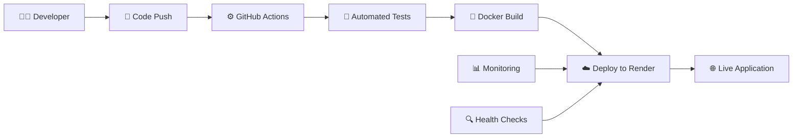

# 🚀 StudySync DevOps Platform

<div align="center">

**Enterprise-grade DevOps implementation of a collaborative study platform**  
*Showcasing modern CI/CD pipelines, containerization, and cloud deployment strategies*

[](https://github.com/DevDhruvX/DevOps-Project/actions)
[](https://github.com/DevDhruvX/DevOps-Project/actions)
[](https://hub.docker.com/)
[](https://www.mongodb.com/)
[](https://reactjs.org/)
[](https://nodejs.org/)
[](https://render.com/)
[](LICENSE)

[🌐 **Live Demo**](https://studysync-frontend-v7wk.onrender.com) | [📊 **CI/CD Dashboard**](https://github.com/DevDhruvX/DevOps-Project/actions) | [📖 **Documentation**](docs/)

</div>

## 📚 What is StudySync?

StudySync is a full-stack web application that helps students organize their study materials with enterprise-grade DevOps implementation. Students can:

- Create subjects (like Math, Science, History)
- Add notes to each subject
- Save YouTube links and other study resources
- Organize everything in folders

## 🏗️ Project Architecture

```
StudySync Application
│
├── Frontend (React.js)
│   ├── Dashboard - View all subjects
│   ├── Notes Page - Manage notes for each subject
│   └── Components - Reusable UI elements
│
├── Backend (Node.js + Express)
│   ├── API Routes - Handle HTTP requests
│   ├── Database Models - Define data structure
│   └── MongoDB - Store subjects and notes
│
└── DevOps Pipeline
    ├── Docker - Package the app in containers
    ├── GitHub Actions - Automate deployment
    └── AWS ECS - Run the app in the cloud
```

## 🎯 **Key Features**

### � **Application Features**
- 🗂️ **Subject Management**: Create and organize study subjects
- 📝 **Note Taking**: Rich text editor with markdown support  
- 🔗 **Resource Links**: Save and organize YouTube links & study materials
- 🔍 **Smart Search**: Find notes and resources quickly
- 👥 **Collaboration**: Share notes and study materials with classmates
- 📱 **Responsive Design**: Works seamlessly on desktop, tablet, and mobile

### 🛠️ **DevOps Features**
- 🐳 **Full Containerization**: Docker multi-service architecture
- 🚀 **Automated CI/CD**: GitHub Actions pipeline with testing & deployment  
- ☁️ **Cloud Deployment**: Production deployment on Render platform
- 📊 **Health Monitoring**: Real-time application and infrastructure monitoring
- 🔒 **Security**: JWT authentication, input validation, security headers
- 📈 **Performance**: Redis caching, optimized builds, performance monitoring

## 🏗️ **DevOps Pipeline Flow**



1. **Code Push** → Triggers automated pipeline
2. **Testing** → Runs comprehensive test suite  
3. **Building** → Creates optimized Docker images
4. **Deployment** → Auto-deploys to cloud infrastructure
5. **Monitoring** → Continuous health and performance tracking

## 📁 **Project Architecture**

```
studysync/
├── 📱 frontend/              # React TypeScript application
│   ├── src/
│   │   ├── components/       # Reusable UI components
│   │   ├── pages/           # Application routes/pages
│   │   ├── services/        # API integration layer
│   │   └── contexts/        # React context for state management
│   ├── Dockerfile           # Frontend container configuration
│   └── package.json         # Dependencies and scripts
│
├── 🖥️ backend/               # Node.js Express API server  
│   ├── routes/              # API endpoint definitions
│   ├── models/              # MongoDB data models
│   ├── middleware/          # Authentication & validation
│   ├── config/              # Database and app configuration
│   ├── Dockerfile           # Backend container configuration
│   └── package.json         # Dependencies and scripts
│
├── 🚀 .github/workflows/     # CI/CD automation pipelines
│   ├── ci-cd.yml           # Main deployment pipeline
│   └── simple-ci.yml       # Testing pipeline
│
├── 🐳 docker-compose.yml     # Multi-container orchestration
├── 📊 docker/               # Additional Docker configurations
├── 📚 docs/                 # Comprehensive documentation  
├── 🔧 scripts/              # Utility and setup scripts
└── 📋 README.md             # Project documentation
```

## 🛠️ **Technology Stack**

### **Frontend Stack**
- **React 19** - Latest React with concurrent features
- **TypeScript** - Type safety and enhanced developer experience  
- **Vite** - Lightning fast build tool and dev server
- **Tailwind CSS** - Utility-first CSS framework
- **Framer Motion** - Smooth animations and transitions
- **Axios** - HTTP client for API communication

### **Backend Stack**
- **Node.js** - JavaScript runtime environment
- **Express.js** - Fast web application framework
- **MongoDB** - NoSQL database with Mongoose ODM
- **JWT** - JSON Web Tokens for authentication
- **bcrypt** - Password hashing and security

### **DevOps & Infrastructure**
- **Docker** - Containerization platform
- **Docker Compose** - Multi-container orchestration
- **GitHub Actions** - CI/CD automation
- **Render** - Cloud deployment platform
- **MongoDB Atlas** - Cloud database service
- **Redis** - In-memory caching
- **Grafana** - Monitoring and analytics

## 🚀 **Quick Start**

### **Prerequisites**
- Docker Desktop installed
- Git installed
- Node.js 18+ (for local development)

### **🐳 Run with Docker (Recommended)**
```bash
# Clone the repository
git clone https://github.com/DevDhruvX/DevOps-Project.git
cd DevOps-Project

# Start all services with Docker Compose
docker compose up -d

# View running containers
docker compose ps

# Access the application
# Frontend: http://localhost:3000
# Backend API: http://localhost:5000
# Grafana: http://localhost:3001
```

### **💻 Local Development Setup**
```bash
# Backend setup
cd backend
npm install
npm run dev

# Frontend setup (new terminal)
cd frontend  
npm install
npm run dev
```

## 🧪 **Testing & Quality Assurance**

```bash
# Run all tests
npm test

# Frontend tests
cd frontend && npm test

# Backend tests  
cd backend && npm test

# Test coverage report
npm run test:coverage

# Linting
npm run lint
```

## 📊 **Monitoring & Health Checks**

### **Health Endpoints**
- **Backend Health**: `http://localhost:5000/api/health`
- **Database Status**: Included in health check response
- **Container Status**: `docker compose ps`

### **Monitoring Dashboard**
- **Grafana**: `http://localhost:3001`
- **Default Credentials**: admin/admin

## 🌐 **Live Deployment**

### **Production URLs**
- **🌐 Frontend**: [https://studysync-frontend-v7wk.onrender.com](https://studysync-frontend-v7wk.onrender.com)  
- **🔗 Backend API**: [https://studysync-backend-0qov.onrender.com](https://studysync-backend-0qov.onrender.com)
- **📊 CI/CD Pipeline**: [GitHub Actions](https://github.com/DevDhruvX/DevOps-Project/actions)

### **Deployment Process**
1. Push to `main` branch triggers GitHub Actions
2. Automated tests run for quality assurance  
3. Docker images built and optimized
4. Deployment to Render platform with zero downtime
5. Health checks verify successful deployment

## 📚 **Documentation**

- 📖 **[Architecture Guide](docs/ARCHITECTURE.md)** - Detailed system architecture
- 🚀 **[Deployment Guide](docs/DEPLOYMENT.md)** - Step-by-step deployment instructions  
- 🔒 **[Security Policy](SECURITY.md)** - Security measures and reporting
- 🤝 **[Contributing Guide](CONTRIBUTING.md)** - How to contribute to the project
- 📋 **[Changelog](CHANGELOG.md)** - Version history and updates

## 🎯 **DevOps Achievements**

### **✅ Infrastructure as Code**
- Dockerized multi-service architecture
- Container orchestration with Docker Compose
- Environment-specific configurations

### **✅ Continuous Integration/Continuous Deployment**
- Automated testing on every push
- Multi-stage deployment pipeline
- Zero-downtime deployments
- Automated rollback capabilities

### **✅ Monitoring & Observability**
- Application health monitoring
- Performance metrics tracking  
- Structured logging implementation
- Error tracking and alerting

### **✅ Security Best Practices**
- Container security scanning
- Secrets management
- Authentication and authorization
- Input validation and sanitization

### **✅ Performance Optimization**
- Redis caching implementation
- Database query optimization
- CDN and asset optimization
- Load balancing ready architecture

## 💰 **Cost Optimization**

**Total Monthly Cost: $0** (Using free tiers)

- **GitHub**: Free public repository with Actions
- **Render**: Free tier with automatic sleep
- **MongoDB Atlas**: 512MB free tier  
- **Docker**: Free personal use
- **Domain**: Using provided Render subdomain

## 🤝 **Contributing**

We welcome contributions! Please see our [Contributing Guide](CONTRIBUTING.md) for details.

1. Fork the repository
2. Create your feature branch (`git checkout -b feature/amazing-feature`)
3. Commit your changes (`git commit -m 'Add amazing feature'`)
4. Push to the branch (`git push origin feature/amazing-feature`)
5. Open a Pull Request

## 📄 **License**

This project is licensed under the MIT License - see the [LICENSE](LICENSE) file for details.

## 🙋‍♂️ **Support**

- 📧 **Email**: support@studysync-devops.com
- 📱 **Issues**: [GitHub Issues](https://github.com/DevDhruvX/DevOps-Project/issues)
- 📚 **Documentation**: [Project Wiki](https://github.com/DevDhruvX/DevOps-Project/wiki)

## 🌟 **Acknowledgments**

- Built with modern DevOps practices and cloud-native technologies
- Inspired by enterprise-grade application architecture
- Designed for educational and professional development purposes

---

<div align="center">

**⭐ If you found this project helpful, please give it a star! ⭐**

*Built with ❤️ for the DevOps community*

</div>
