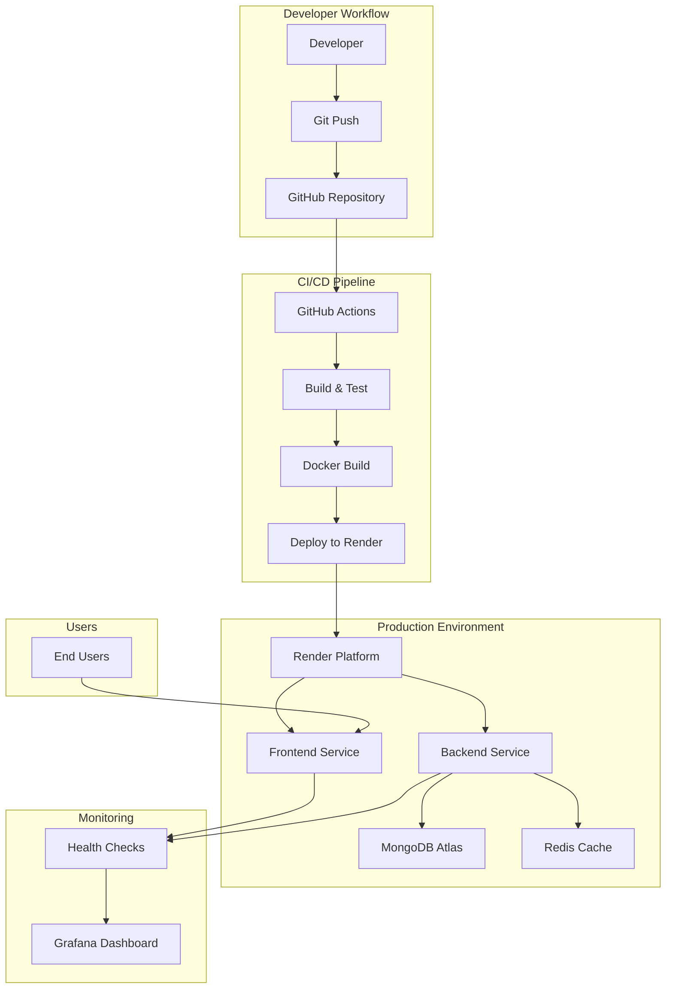

# DevOps Architecture Documentation

## 🏗️ System Architecture Overview



## 🔧 Technology Stack

### Frontend Architecture
```
React Application
├── Components/ (UI Components)
├── Pages/ (Route Components)  
├── Services/ (API Integration)
├── Contexts/ (State Management)
└── Assets/ (Static Resources)
```

**Technologies:**
- **React 19**: Latest React with concurrent features
- **TypeScript**: Type safety and better development experience
- **Vite**: Fast build tool and development server
- **Tailwind CSS**: Utility-first CSS framework
- **Framer Motion**: Animation library
- **Axios**: HTTP client for API calls

### Backend Architecture
```
Node.js API Server
├── Routes/ (API Endpoints)
├── Models/ (Database Schemas)
├── Middleware/ (Authentication, Validation)
├── Config/ (Database, Environment)
└── Tests/ (Unit & Integration Tests)
```

**Technologies:**
- **Node.js**: JavaScript runtime
- **Express.js**: Web application framework
- **MongoDB**: NoSQL database with Mongoose ODM
- **JWT**: JSON Web Tokens for authentication
- **bcrypt**: Password hashing
- **Helmet**: Security headers

### Database Design
```
MongoDB Collections:
├── users (User accounts & profiles)
├── subjects (Study subjects/categories)
├── notes (Individual notes & content)
└── shares (Shared content tracking)
```

### DevOps Infrastructure
```
Container Architecture:
├── Frontend Container (Nginx + React build)
├── Backend Container (Node.js + Express)
├── MongoDB Container (Database)
├── Redis Container (Caching)
└── Grafana Container (Monitoring)
```

## 🚀 CI/CD Pipeline Details

### Workflow Triggers
- **Push to main**: Full deployment pipeline
- **Pull Requests**: Testing and validation
- **Manual**: Emergency deployments

### Pipeline Stages

#### 1. Code Quality Checks
```yaml
- Linting (ESLint)
- Type checking (TypeScript)
- Security scanning
- Dependency vulnerability checks
```

#### 2. Testing Phase
```yaml
- Unit tests (Frontend & Backend)
- Integration tests
- API endpoint testing
- UI component testing
```

#### 3. Build Phase
```yaml
- Docker image building
- Multi-stage optimization
- Image security scanning
- Artifact generation
```

#### 4. Deployment Phase
```yaml
- Environment configuration
- Database migrations
- Health check validation
- Traffic routing
```

## 🐳 Container Strategy

### Multi-Stage Docker Builds
```dockerfile
# Stage 1: Build
FROM node:18-alpine AS builder
# Build application

# Stage 2: Production  
FROM node:18-alpine AS production
# Copy built artifacts only
```

### Container Orchestration
```yaml
services:
  frontend:    # React app served by Nginx
  backend:     # Node.js API server
  mongodb:     # Database with persistence
  redis:       # Caching layer
  grafana:     # Monitoring dashboard
```

## 🔒 Security Implementation

### Application Security
- **Authentication**: JWT tokens with expiration
- **Authorization**: Role-based access control
- **Input Validation**: Server-side validation for all inputs
- **Password Security**: bcrypt hashing with salt rounds
- **CORS**: Configured for specific origins only

### Infrastructure Security
- **Container Security**: Non-root users, minimal base images
- **Network Security**: Container isolation, defined networks
- **Secrets Management**: Environment variables, no hardcoded secrets
- **HTTPS**: TLS termination at load balancer level

### CI/CD Security
- **Secret Scanning**: Automated detection of exposed secrets
- **Dependency Scanning**: Vulnerability assessment of packages
- **Image Scanning**: Container security analysis
- **Access Control**: Restricted deployment permissions

## 📊 Monitoring & Observability

### Health Monitoring
```json
{
  "status": "healthy",
  "timestamp": "2025-11-12T08:25:03.793Z",
  "service": "StudySync Backend API",
  "version": "1.0.0",
  "uptime": {"seconds": 90, "human": "0h 1m 30s"},
  "database": {"status": "connected", "responsive": true}
}
```

### Logging Strategy
- **Application Logs**: Structured JSON logging
- **Access Logs**: HTTP request/response logging  
- **Error Tracking**: Centralized error collection
- **Performance Metrics**: Response time tracking

### Alerting
- **Health Check Failures**: Immediate notification
- **Resource Usage**: CPU/Memory threshold alerts
- **Error Rates**: Elevated error percentage alerts
- **Deployment Status**: Success/failure notifications

## 🌐 Deployment Strategy

### Environment Management
```
Development → Staging → Production
     ↓            ↓          ↓
  Local Dev   →  Testing  → Live Site
```

### Zero-Downtime Deployment
1. **Blue-Green Strategy**: Maintain two identical environments
2. **Health Checks**: Verify new deployment before traffic switch
3. **Rollback Plan**: Automated rollback on failure detection
4. **Database Migrations**: Safe, reversible schema changes

### Scaling Strategy
- **Horizontal Scaling**: Multiple container instances
- **Load Balancing**: Traffic distribution across instances
- **Auto-scaling**: Based on CPU/memory utilization
- **Database Scaling**: Read replicas for performance

## 📈 Performance Optimization

### Frontend Optimization
- **Code Splitting**: Dynamic imports for route-based splitting
- **Asset Optimization**: Image compression, minification
- **Caching Strategy**: Browser caching, CDN usage
- **Bundle Analysis**: Webpack bundle analyzer

### Backend Optimization
- **API Caching**: Redis for frequently accessed data
- **Database Indexing**: Optimized queries with proper indexes
- **Connection Pooling**: Efficient database connections
- **Compression**: gzip compression for responses

### Infrastructure Optimization
- **Container Optimization**: Multi-stage builds, minimal images
- **Resource Limits**: CPU/memory constraints per container
- **Network Optimization**: Container networking, service mesh
- **Storage Optimization**: Volume management, cleanup policies

## 🔄 Disaster Recovery

### Backup Strategy
- **Database Backups**: Automated daily backups to cloud storage
- **Code Repository**: Distributed version control with GitHub
- **Configuration Backups**: Infrastructure as code versioning
- **Monitoring Data**: Metrics and logs retention policy

### Recovery Procedures
1. **Service Outage**: Automated health check and restart
2. **Data Loss**: Point-in-time recovery from backups
3. **Infrastructure Failure**: Multi-region deployment strategy
4. **Security Incident**: Incident response playbook

This architecture ensures scalability, maintainability, and reliability while following DevOps best practices.